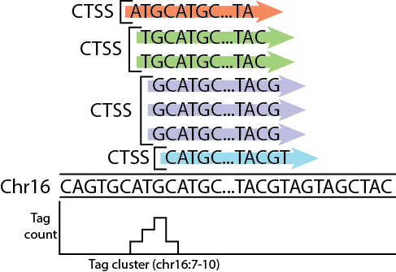
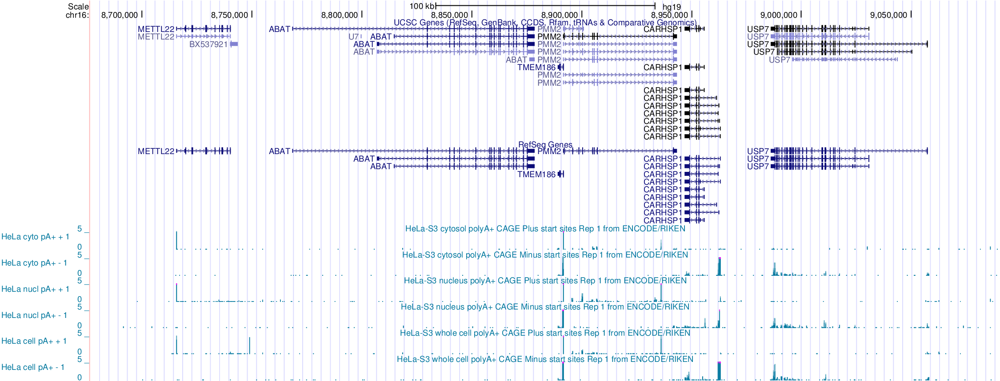
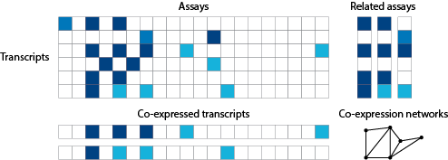

<!-- to publish run
library(slidify)
setwd("/Users/davetang/slidify_test/")
publish('cage_r', 'davetang')
-->

<style>
.title-slide {
  background-color: #FFFFFF;
}

pre {
 white-space: pre-wrap;       /* css-3 */
 white-space: -moz-pre-wrap;  /* Mozilla, since 1999 */
 white-space: -pre-wrap;      /* Opera 4-6 */
 white-space: -o-pre-wrap;    /* Opera 7 */
 word-wrap: break-word;       /* Internet Explorer 5.5+ */
}

</style>

## Welcome!

> * My name is Dave Tang; I was born in Hong Kong but raised in Papua New Guinea.
> * I'm a PhD candidate in bioinformatics at the VU University Amsterdam.
> * I also maintain a [blog](http://davetang.org/muse), where I write about bioinformatics.
> * I'm here to show you how to analyse CAGE data using R in Japan.

*** Presenter notes

Telling people I'm from PNG is usually a good ice breaker, in case they have nothing to ask me at all.

---

## About this presentation

> * I had a lot of difficulty deciding what to present in this talk.
> * I started off extremely ambiguous and believed that it is possible to show you how to analyse CAGE data in under two hours.
> * Then I realised that this isn't possible.
> * This presentation will provide an overview of analysing CAGE data
> * There are links on each slide for those who want to learn more.

*** Presenter notes

Ask audience how many plan to analyse CAGE data.

---

## I will be talking about

> * Cap Analysis Gene Expression (CAGE)
> * Analysing an expression matrix
> * Estimating statistical significance of feature overlaps
> * A CAGE package implemented in R Bioconductor called CAGEr

*** Presenter notes

Hopefully this is enough to last for two hours.

---

## Slidify

> * These slides were made using an R package called [Slidify](http://slidify.org/index.html).
> * All the slides and the output are generated by R; the analysis is run when making the slides.
> * This is the first time I've used Slidify for a presentation.
> * These slides can be viewed at <http://davetang.github.io/cage_r>
> * If you're interested in Slidify, have a look at <http://davetang.org/muse/2014/12/12/making-slides-using-r/> and the links within.

---

## Promoter


Source: <http://www.nature.com/scitable/topicpage/dna-transcription-426>

*** Presenter notes

Promoter regions also contain various transcription factor binding sites

---

## Cap Analysis Gene Expression (CAGE)


Image source: me.

*** Presenter notes

The double strand protects the RNA from RNase I digestion. However, RNAs without a Cap, are not pulled down.

---

## CAGE


For the full protocol see <http://www.ncbi.nlm.nih.gov/pubmed/22362160>.

*** Presenter notes

cDNAs are released from the RNA and a 5' linker (that includes a barcode sequence and EcoP15I sequence) is ligated. Second-strand cDNA synthesis takes place and digestion with EcoP15I takes place. A 3′ linker that contains the 3′ Illumina primer sequence is ligated at the 3′ end. Amplification takes place and the tags are sequenced.

---

## Why do we perform CAGE?

> * Quantify the expression of transcripts
> * Study promoter structure and usage
> * Discover new promoters
> * Discover regulatory elements
> * For CAGE versus RNA-Seq see <http://www.ncbi.nlm.nih.gov/pmc/articles/PMC3975069/>

*** Presenter notes

Piero and Erik showed various CAGE case studies.

---

## A typical CAGE analysis pipeline

> * The output of CAGE is a set of short nucleotide sequences and their counts.
> * Typical steps in a CAGE analysis pipeline include:
> * Tag extraction
> * Quality control steps
> * Mapping tags to a reference genome
> * Tag clustering
> * Tag cluster annotation
> * Data analysis (e.g. differential expression analysis, co-expression networks, etc.)

---

## ENCODE CAGE data

Download these BAM files into some directory:

```
path=http://hgdownload.cse.ucsc.edu/goldenPath/hg19/encodeDCC/wgEncodeRikenCage
curl -O $path/wgEncodeRikenCageHelas3CellPapRawDataRep1.fastq.gz
curl -O $path/wgEncodeRikenCageHelas3CellPapAlnRep1.bam
curl -O $path/wgEncodeRikenCageHelas3CellPapAlnRep2.bam
curl -O $path/wgEncodeRikenCageHelas3CytosolPapAlnRep1.bam
curl -O $path/wgEncodeRikenCageHelas3CytosolPapAlnRep2.bam
curl -O $path/wgEncodeRikenCageHelas3NucleusPapAlnRep1.bam
curl -O $path/wgEncodeRikenCageHelas3NucleusPapAlnRep2.bam
```

---

## Raw sequencing data

A [fastq](http://en.wikipedia.org/wiki/FASTQ_format) file contains all the reads from the sequencer.

```
gunzip -c wgEncodeRikenCageHelas3CellPapRawDataRep1.fastq.gz | head -4
@HWUSI-EAS566_0007:5:1:965:4705#0/1
NAGCAGCAGGGGAGAGTGTCATGGAGGCCTACGAGC
+HWUSI-EAS566_0007:5:1:965:4705#0/1
BYZZY\\[\[^^IXMVUUUX\]\\X[ZZ\]``^__^
```

For each read, there are four lines of information.

1. The first line is the read name and contains information on the read
2. The second line is the raw sequence of the CAGE tag
3. The third line can be used to store optional notes
4. The fourth line denotes the quality of each base call, i.e. how sure the machine is that an A is an A.

---

## Tag extraction

```
gunzip -c wgEncodeRikenCageHelas3CellPapRawDataRep1.fastq.gz | head -4
@HWUSI-EAS566_0007:5:1:965:4705#0/1
NAGCAGCAGGGGAGAGTGTCATGGAGGCCTACGAGC
+HWUSI-EAS566_0007:5:1:965:4705#0/1
BYZZY\\[\[^^IXMVUUUX\]\\X[ZZ\]``^__^

gunzip -c wgEncodeRikenCageHelas3CellPapRawDataRep1.fastq.gz | perl -nle 'if (($. - 2) % 4 == 0){ print substr($_,0,4)}' | sort | uniq -c | sort -k1,1rn | head -4
25498964 TAGC
288819 TATC
154406 TCGT
117149 CAGC
```

The barcode for this library was TAGC. The <http://hannonlab.cshl.edu/fastx_toolkit/> contains tools for tag extraction. See also <http://tagdust.sourceforge.net/>, which uses Hidden Markov Models for tag extraction (and performs quality control steps).

---

## Quality control

```
gunzip -c wgEncodeRikenCageHelas3CellPapRawDataRep1.fastq.gz | head -4
@HWUSI-EAS566_0007:5:1:965:4705#0/1
NAGCAGCAGGGGAGAGTGTCATGGAGGCCTACGAGC
+HWUSI-EAS566_0007:5:1:965:4705#0/1
BYZZY\\[\[^^IXMVUUUX\]\\X[ZZ\]``^__^
```

We would remove this read because it contains an ambiguous base call, especially since it's in the barcode. The quality scores range from 3 to 40:

<pre>
3------------------------------------40

BCDEFGHIJKLMNOPQRSTUVWXYZ[\]^_`abcdefgh
</pre>

Various different criteria to remove reads, e.g. remove reads with 10 base calls that have a quality less than 10, etc. The tool <http://samstat.sourceforge.net/> can be used to calculate and visualise read qualities.

---

## A note about quality scores

```{r, out.width='300px'}
p <- function(q){ return(10^{-q/10}) }
p(10)
plot(3:37, 1-p(3:37), xaxt='n', type='l', xlab='Quality score', ylab='Probability correct')
axis(1, 0:40); abline(h=0.9, v=10)
```

*** Presenter notes

If a base has a quality of 10, there's a 10% probability that a read is incorrect.

---

## Mapping

> * High-throughput sequencing results in millions to billions of reads
> * A computational strategy known as "indexing" speeds up mapping algorithms.
> * It works like a book index; an index of a large DNA sequence allows one to rapidly find shorter sequences embedded within it. See [How to map billions of short reads onto genomes](http://www.ncbi.nlm.nih.gov/pubmed/19430453).
> * The confidence of mapping is indicated by the mapping quality, which uses the same scale as the base calling qualities.
> * Pipelines may remove reads that have a low mapping quality.
> * I have a post on [mapping qualities](http://davetang.org/muse/2011/09/14/mapping-qualities/).

---

## SAM/BAM

A SAM/BAM file contains alignment information of a single read to a reference genome.

```
samtools view wgEncodeRikenCageHelas3CellPapAlnRep1.bam | head -3
HWUSI-EAS566_0009:3:16:8371:2418#0|TAG  16  chr1	16213	1	27M	*	0	0	GCCATGCTCTGACAGTCTCAGTTGCAC	fefffffffffffffdfefddffdddd	NM:i:0	MD:Z:27	XP:Z:~~~~-----000077777,,,,9998:
HWUSI-EAS566_0007:5:11:4550:12891#0|TAG	16	chr1	16445	17	27M	*	0	0	AGTTTGAAAACCACTATTTTATGAACC	fefffffdffffffeffdffffeefff	NM:i:0	MD:Z:27	XP:Z:~~~~~~~~~~~~~~~~~~~~~~~LO?~
HWUSI-EAS566_0007:5:63:12130:4370#0|TAG	0	chr1	16446	17	27M	*	0	0	GTTTGAAAACCACTATTTTATGAACCA	fffffdfffffdffffffffffefffe	NM:i:0	MD:Z:27	XP:Z:~~~~~~~~~~~~~~~~~~~~~~~~~L~
```

If you are confused about the second column, have a look at <http://davetang.org/muse/2014/03/06/understanding-bam-flags/>.

---

## CAGE defined transcriptional starting sites



Image source: me.

---

## Tag cluster annotation

Intersect/overlap tag clusters to transcript annotations



---

## Intermission

* Any questions so far?

---

## A few words on R before we begin

> * I have been using R on and off for a couple of years and it takes a while to get used to.
> * Honest confession: I am not very good with R (I keep a lot of [documentation](http://davetang.org/muse/r/) to make up for this).
> * I think it is worthwhile learning because a lot of genomics analysis packages are available via the Bioconductor project.
> * By default, data loaded into R is stored into memory; the bigger your data, the more memory will be used.

---

## Bioconductor

> * From [Wikipedia](http://en.wikipedia.org/wiki/Bioconductor): Bioconductor is a free, open source and open development software project for the analysis and comprehension of genomic data generated by wet lab experiments in molecular biology.
> * Provides state of the art software to analyse various genomic datasets.
> * Has very well written guides, called vignettes, aimed at biologists.
> * To learn more take a look at these [courses](http://bioconductor.org/help/course-materials/), which are provided by the Bioconductor team.

*** Presenter notes

It's pronounced "vin yet".

---

## Expression matrix

I will be using an example dataset from the DESeq package.

```{r eval=FALSE}
source("http://bioconductor.org/biocLite.R")
biocLite("DESeq")
```
```{r, message=FALSE}
library("DESeq")
example_file <- system.file ("extra/TagSeqExample.tab", package="DESeq")
data <- read.delim(example_file, header=T, row.names="gene")
head(data)
```

---

## Working with data frames

```{r}
class(data)
dim(data)
head(rowSums(data))
```

---

## Plotting the rowSums

```{r}
plot(density(log2(rowSums(data))), xlab="Gene expression (log2)")
```

---

## Independent filtering

```{r}
dim(data)
data_subset <- subset(data, rowSums(data)>30)
dim(data_subset)
```

See <http://www.ncbi.nlm.nih.gov/pubmed/20460310>.

---

## Differential expression

```{r eval=FALSE}
source("http://bioconductor.org/biocLite.R")
biocLite("edgeR")
```
```{r, message=FALSE}
library(edgeR)
group <- c('tumour', 'tumour', 'tumour', 'tumour', 'normal', 'normal')
d <- DGEList(counts = data_subset, group=group)
#data normalisation
d <- calcNormFactors(d, method="TMM")
d <- estimateDisp(d)
et <- exactTest(d)
summary(de <- decideTestsDGE(et, p=0.05, adjust="BH"))
```

---

## Differentially expressed genes

```{r, out.width='450px'}
detags <- rownames(d)[as.logical(de)]
plotSmear(et, de.tags=detags)
abline(h = c(-2, 2), col = "blue")
```

---

## Differentially expression genes

```{r}
my_list <- topTags(et, n=204)
```

---

## Correlation

See <http://davetang.org/muse/2012/01/31/creating-a-correlation-matrix-with-r/>



Image source: adpated from <http://www.ncbi.nlm.nih.gov/pubmed/20628352>.

---

## Pairwise comparisons

```{r}
#a vs. b, a vs. c, b vs. c
choose(3,2)
choose(1000, 2)
choose(30000, 2)
```

---

## Pairwise comparisons

```{r}
plot(1000:30000, log2(choose(1000:30000, 2)), type='l', xlab="n", ylab="Pairwise comparisons (log2)")
```

---

## Jaccard statistic

```
bedtools jaccard -a cpg.bed -b enhancer.bed 
intersection    union-intersection  jaccard n_intersections
1148180 132977386   0.0086344   4969
 
bedtools jaccard -a cpg.bed -b promoter.bed 
intersection    union-intersection  jaccard n_intersections
15661111    53551816    0.292448    20402
```

*** Presenter notes

This is a simply demonstration of feature overlap.

---

## CAGEr

The CAGEr package available on Bioconductor provides various methods for analysing CAGE data. To install the CAGEr package:

```{r eval=FALSE}
source("http://bioconductor.org/biocLite.R")
biocLite("CAGEr")
```

To load the CAGEr package:

```{r eval=FALSE}
library(CAGEr)
```

For more information: <http://davetang.org/muse/2013/04/16/cage-analysis-using-the-r-bioconductor-package-cage/>.

*** Presenter notes

I decided it wasn't feasible to perform a live demo because

- CAGE data is huge
- Loading the data is slow and computationally intensive
- The vignette provides all the details

---

## What CAGEr can do

> * Quality control steps
> * CAGE normalisation
> * CAGE tag clustering
> * Analysis of promoter shape
> * Expression clustering
> * Analysis of promoter shifting
> * Importantly, we can use the CAGEr package to prepare our data for further downstream analyses

*** Presenter notes

Michiel talked about level one and two tag clustering.

---

## Loading BAM files

First we need to set the working directory to where the BAM files are:

```{r eval=FALSE}
setwd("/Users/davetang/tmp/cage")
library(BSgenome.Hsapiens.UCSC.hg19)
bam_file <- list.files(".", full.names=T, pattern="*.bam")
bam_file
cage_bam <- new("CAGEset", genomeName = "BSgenome.Hsapiens.UCSC.hg19", inputFiles = bam_file, inputFilesType = 'bam', sampleLabels = c('cell_1','cell_2','cytosol_1','cytosol_2','nucleus_1','nucleus_2'))
cage_bam
```

---

## Tag clustering

```{r eval=FALSE}
getCTSS(cage_bam, mappingQualityThreshold=10)
normalizeTagCount(cage_bam, method = "simpleTpm")
clusterCTSS(object = cage_bam, threshold = 1, thresholdIsTpm = TRUE, nrPassThreshold = 1, method = "distclu", maxDist = 20, removeSingletons = TRUE, keepSingletonsAbove = 5, useMulticore = T, nrCores = 6)
```

*** Presenter notes

This is computationally intensive even for six libraries.

---

## The need for normalisation

```{r}
control_1 <- rep(10, 50)
control_2 <- rep(10, 50)
patient_1 <- c(rep(20, 25),rep(0,25))
patient_2 <- c(rep(20, 25),rep(0,25))
df <- data.frame(c1=control_1, c2=control_2, p1=patient_1, p2=patient_2)
head(df, 2)
tail(df, 2)
```

---

## The need for normalisation

```{r echo=FALSE}
library(gplots)
heatmap.2(x = as.matrix(df),
          trace="none",
          dendrogram="none")
```

---

## Differential expression without normalisation

```{r, message=FALSE}
library(edgeR)
group <- c('control','control','patient','patient')
d <- DGEList(counts=df, group=group)
d <- estimateCommonDisp(d)
de <- exactTest(d)
table(p.adjust(de$table$PValue, method="BH")<0.05)
```

---

## Differential expression with normalisation

```{r, message=FALSE}
TMM <- calcNormFactors(d, method="TMM")
TMM$samples
TMM <- estimateCommonDisp(TMM)
TMM <- exactTest(TMM)
table(p.adjust(TMM$table$PValue, method="BH")<0.05)
```

---

## Genomic ranges

> * The coordinate system for describing the location of features on a genome is through genomic ranges.
> * A genomic range indicates the chromosome and position a particular feature is on. For example, HBA1 is on chr16:226650-227521.

---

## Genomic ranges in Bioconductor

```{r}
library(IRanges)
ir <- IRanges(5,10)
ir
ir <- IRanges(start=c(3,5,17), end=c(10,8,20))
ir
```

---

## Statistical significance of feature overlaps

See <http://davetang.org/muse/2014/11/07/using-genometricorr-package/>

```{r eval=FALSE}
install.packages('GenometriCorr',
                 repos='http://genometricorr.sourceforge.net/R/',
                 type='source')

cpg <- read.table(url("http://quinlanlab.cs.virginia.edu/cshl2013/cpg.bed"),
                  header=F,
                  sep="\t",
                  stringsAsFactors = F)

chr <- read.table(url("http://quinlanlab.cs.virginia.edu/cshl2013/hesc.chromHmm.bed"),
                  header=F,
                  sep="\t",
                  stringsAsFactors = F)
```

---

## Interpreting expression data

> * Which clustering techniques are useful for interpreting expression data?
> * A common computational approach is hierarchical clustering
> * SOMs have a number of features that make them particularly well suited to clustering and analysis of expression patterns.

---

## Expression clustering


