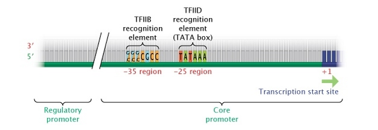
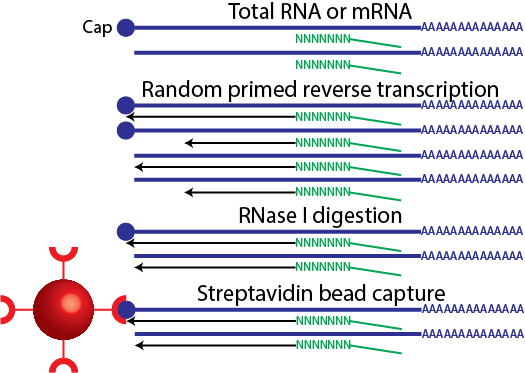
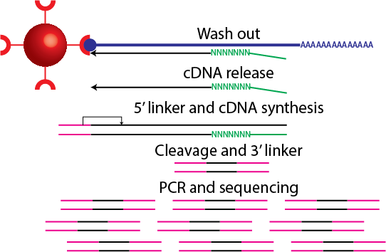

<!-- to publish run
publish('cage_r', 'davetang')
-->

<style>
.title-slide {
  background-color: #FFFFFF;
}
</style>

## Welcome!

> 1. My name is Dave; I was born in Hong Kong but raised in Papua New Guinea.
> 2. I'm a PhD candidate at the VU University Amsterdam.
> 3. I'm here to show you how to analyse CAGE data using R in Japan.

---

## I will be talking about

> 1. Cap Analysis Gene Expression
> 2. Using R and Bioconductor packages to analyse CAGE data, in particular:
 * Estimating statistical significance of feature overlaps
 * Exploratory data analysis using R
 * Data normalisation and differential expression analysis
 * Visualising high-throughput sequencing data

---

## Aims

> 1. I want to explain why specific commands are being used (to the best of my ability), i.e. I don't simply want to teach you a "recipe".
> 2. This is simply because every dataset is different and you can't follow the same recipe each time, and you can interpret your results better.

---

## Slidify

> 1. These slides were made using an R package called Slidify. The output shown in the slides is directly generated by R. This is to aid reproducible research.
> 2. These slides can be viewed and downloaded from <http://davetang.github.io/cage_r>
> 3. If you're interested in Slidify, have a look at <http://davetang.org/muse/2014/12/12/making-slides-using-r/> and the links within.

---

## Promoter



Source: <http://www.nature.com/scitable/topicpage/dna-transcription-426>

---

## Cap Analysis Gene Expression (CAGE)



---

## CAGE



---

## A few words on R

> 1. I have been using R on and off for a couple of years and it took a while to get used to.
> 2. Honest confession: I'm actually not very good with R (I keep a lot of documentation to make up for this).
> 3. You should learn it because a lot of the analysis packages for genomics data are provided via Bioconductor.

---

## Bioconductor

1. From [Wikipedia](http://en.wikipedia.org/wiki/Bioconductor): Bioconductor is a free, open source and open development software project for the analysis and comprehension of genomic data generated by wet lab experiments in molecular biology.
2. Provides state of the art software to analyse various genomic datasets.
3. To learn more take a look at these [courses](http://bioconductor.org/help/course-materials/), which are provided by the Bioconductor team.

---

## CAGE data on Bioconductor

```{r eval=FALSE}
#download and install
source("http://bioconductor.org/biocLite.R")
biocLite("FANTOM3and4CAGE")
```

```{r}
#looking at come CAGE data
library(FANTOM3and4CAGE)
data(FANTOMtissueCAGEhuman)
lung_group <- FANTOMtissueCAGEhuman[["lung"]]
head(lung_group)
```

---

## CAGEr

The CAGEr package available on Bioconductor provides various methods for analysing CAGE data.

```{r eval=FALSE}
source("http://bioconductor.org/biocLite.R")
biocLite("CAGEr")
```

Load the CAGEr package:

```{r eval=FALSE}
library(CAGEr)
```

---

## The need for normalisation

> 1. Local regression (loess)
> 2. Quantile normalisation
> 3. Counts per million
> 4. RLE

---

## Genomic ranges

```{r eval=FALSE}
library(IRanges)
ir <- IRanges(5,10)
ir
start(ir)
end(ir)
width(ir)
```

---

## Statistical significance of feature overlaps

Check out my blog post <http://davetang.org/muse/2014/11/07/using-genometricorr-package/>

```{r eval=FALSE}
install.packages('GenometriCorr',
                 repos='http://genometricorr.sourceforge.net/R/',
                 type='source')

cpg <- read.table(url("http://quinlanlab.cs.virginia.edu/cshl2013/cpg.bed"),
                  header=F,
                  sep="\t",
                  stringsAsFactors = F)

chr <- read.table(url("http://quinlanlab.cs.virginia.edu/cshl2013/hesc.chromHmm.bed"),
                  header=F,
                  sep="\t",
                  stringsAsFactors = F)
```

---

## Random heatmap

```{r}
set.seed(31)
image(matrix(rnorm(100),nrow=10))
```

---

## Clustering


---

## Formula

$$ a^2 + b^2 = c^2 $$

---

## Getting help in R

```{r eval=FALSE}
#returns all the functions with 'table' in the name
apropos('table')
#opens the documentation for the function 'table'
?table
```

---

## To be continued

