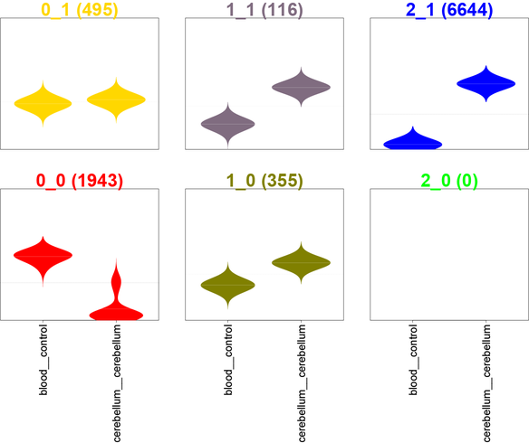

<style>
.title-slide {
  background-color: #FFFFFF;
}
</style>

## Welcome!

> 1. My name is Dave
> 2. I'm a PhD student here at RIKEN
> 3. I'm here to (hopefully) show you how to analyse CAGE data using R. (Some of the methods can be applied to other high-throughput sequencing datasets.)

---

## I will be talking about

> 1. Estimating statistical significance of feature overlaps
> 2. Exploratory data analysis using R
> 3. Data normalisation and differential expression analysis
> 4. Visualising high-throughput sequencing data

---

## Aims

> 1. I want to explain why specific commands are being used (to the best of my ability), i.e. I don't simply want to teach you a "recipe".
> 2. This is simply because every dataset is different and you can't follow the same recipe each time, and you can interpret your results better.

---

## Slidify

> 1. These slides were made using an R package called Slidify. The output shown in the slides is directly generated by R. This is to aid reproducible research.
> 2. The slides can be viewed and downloaded from <http://davetang.github.io/cage_r>
> 3. If you're interested in Slidify, have a look at <http://davetang.org/muse/2014/12/12/making-slides-using-r/>

---

## CAGEr

We will be using the CAGEr package, so we need to install it. While we're at it, we can download/install some FANTOM3 and FANTOM4 CAGE data:

```
source("http://bioconductor.org/biocLite.R")
biocLite("CAGEr")
biocLite("FANTOM3and4CAGE")
```

Loading the libraries

```{r}
library(CAGEr)
library(FANTOM3and4CAGE)
```

---

## Getting started

```{r}
data(FANTOMhumanSamples)
head(FANTOMhumanSamples)
```

---

## Random heatmap

```{r}
set.seed(31)
image(matrix(rnorm(100),nrow=10))
```

---

## Clustering



---

## Formula

$$ a^2 + b^2 = c^2 $$