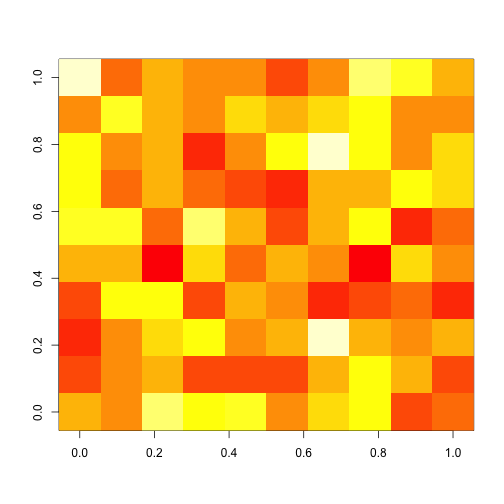

<style>
.title-slide {
  background-color: #FFFFFF;
}
</style>

## Welcome!

> 1. My name is Dave
> 2. I'm a PhD student here at RIKEN
> 3. I'm here to (hopefully) show you how to analyse CAGE data using R

---

## CAGEr

We will be using the CAGEr package, so we need to install it. While we're at it, we can download/install some FANTOM3 and FANTOM4 CAGE data:

```
source("http://bioconductor.org/biocLite.R")
biocLite("CAGEr")
biocLite("FANTOM3and4CAGE")
```

Loading the libraries


```r
library(CAGEr)
library(FANTOM3and4CAGE)
```

---

## Getting started


```r
data(FANTOMhumanSamples)
head(FANTOMhumanSamples)
```

```
##                 dataset           group          sample
## 1 FANTOMtissueCAGEhuman        cerebrum        cerebrum
## 2 FANTOMtissueCAGEhuman    renal_artery    renal_artery
## 3 FANTOMtissueCAGEhuman          ureter          ureter
## 4 FANTOMtissueCAGEhuman urinary_bladder urinary_bladder
## 5 FANTOMtissueCAGEhuman          kidney      malignancy
## 6 FANTOMtissueCAGEhuman          kidney          kidney
```

---

## Random heatmap


```r
set.seed(31)
image(matrix(rnorm(100),nrow=10))
```

 
