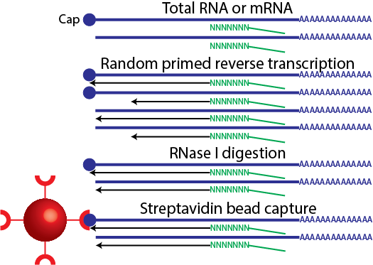

<!-- to publish run
library(slidify)
setwd("/Users/davetang/slidify_test/")
publish('cage_r', 'davetang')
-->

<style>
.title-slide {
  background-color: #FFFFFF;
}

pre {
 white-space: pre-wrap;       /* css-3 */
 white-space: -moz-pre-wrap;  /* Mozilla, since 1999 */
 white-space: -pre-wrap;      /* Opera 4-6 */
 white-space: -o-pre-wrap;    /* Opera 7 */
 word-wrap: break-word;       /* Internet Explorer 5.5+ */
}

</style>

## Welcome!

> * My name is Dave Tang; I was born in Hong Kong but raised in Papua New Guinea.
> * I'm a PhD candidate in bioinformatics at the VU University Amsterdam.
> * I also maintain a [blog](http://davetang.org/muse), where I write about bioinformatics.
> * I'm here to show you how to analyse CAGE data using R in Japan.

---

## About this presentation

> * I had a lot of difficulty deciding what to present in this talk.
> * I started off extremely ambiguous and believed that it is possible to show you how to analyse CAGE data in under two hours.
> * I realised that this isn't possible.
> * I finally decided that this presentation will be about the concepts of CAGE analysis and I will provide links on each slide for those who want to learn more.

---

## I will be talking about

> * Cap Analysis Gene Expression (CAGE)
> * Using R and Bioconductor packages to analyse CAGE data
> * Estimating statistical significance of feature overlaps
> * Data normalisation and differential expression analysis
> * Data visualistion of CAGE data in R

---

## Slidify

> * These slides were made using an R package called [Slidify](http://slidify.org/index.html).
> * All the slides and the output are generated by R; the analysis is run when making the slides.
> * This is the first time I've used Slidify for a presentation.
> * These slides can be viewed and downloaded at <http://davetang.github.io/cage_r>
> * If you're interested in Slidify, have a look at <http://davetang.org/muse/2014/12/12/making-slides-using-r/> and the links within.

---

## Promoter


Source: <http://www.nature.com/scitable/topicpage/dna-transcription-426>

---

## Cap Analysis Gene Expression (CAGE)



Image source: me.

---

## CAGE


Image source: me.

---

## CAGE

> * The output of CAGE is a set of short nucleotide sequences and their counts.
> * Typical steps in a CAGE analysis pipeline include:
> * Tag extraction
> * Quality control steps
> * Mapping tags to a reference genome
> * Tag clustering
> * Tag cluster annotation
> * Data analysis (e.g. differential expression analysis, co-expression networks, etc.)

---

## Why do we perform CAGE?

> * Quantify the expression of transcripts
> * Study promoter structure and usage
> * Discover new promoters
> * Discover regulatory elements

---

## ENCODE CAGE data

Download these BAM files into some directory:

```
path=http://hgdownload.cse.ucsc.edu/goldenPath/hg19/encodeDCC/wgEncodeRikenCage
curl -O $path/wgEncodeRikenCageHelas3CellPapRawDataRep1.fastq.gz
curl -O $path/wgEncodeRikenCageHelas3CellPapAlnRep1.bam
curl -O $path/wgEncodeRikenCageHelas3CellPapAlnRep2.bam
curl -O $path/wgEncodeRikenCageHelas3CytosolPapAlnRep1.bam
curl -O $path/wgEncodeRikenCageHelas3CytosolPapAlnRep2.bam
curl -O $path/wgEncodeRikenCageHelas3NucleusPapAlnRep1.bam
curl -O $path/wgEncodeRikenCageHelas3NucleusPapAlnRep2.bam
```

---

## Raw CAGE data

A [fastq](http://en.wikipedia.org/wiki/FASTQ_format) file contains all the reads from the sequencer.

```
gunzip -c wgEncodeRikenCageHelas3CellPapRawDataRep1.fastq.gz | head -4
@HWUSI-EAS566_0007:5:1:965:4705#0/1
NAGCAGCAGGGGAGAGTGTCATGGAGGCCTACGAGC
+HWUSI-EAS566_0007:5:1:965:4705#0/1
BYZZY\\[\[^^IXMVUUUX\]\\X[ZZ\]``^__^
```

For each read, there are four lines of information.

1. The first line is the read name and contains information on the read
2. The second line is the raw sequence of the CAGE tag
3. The third line can be used to store optional notes
4. The fourth line denotes the quality of each base call, i.e. how sure the machine is that an A is an A.

---

## Tag extraction

```
gunzip -c wgEncodeRikenCageHelas3CellPapRawDataRep1.fastq.gz | head -4
@HWUSI-EAS566_0007:5:1:965:4705#0/1
NAGCAGCAGGGGAGAGTGTCATGGAGGCCTACGAGC
+HWUSI-EAS566_0007:5:1:965:4705#0/1
BYZZY\\[\[^^IXMVUUUX\]\\X[ZZ\]``^__^

gunzip -c wgEncodeRikenCageHelas3CellPapRawDataRep1.fastq.gz | perl -nle 'if (($. - 2) % 4 == 0){ print substr($_,0,4)}' | sort | uniq -c | sort -k1,1rn | head -4
25498964 TAGC
288819 TATC
154406 TCGT
117149 CAGC
```

The barcode for this library was TAGC.

---

## Quality control

```
gunzip -c wgEncodeRikenCageHelas3CellPapRawDataRep1.fastq.gz | head -4
@HWUSI-EAS566_0007:5:1:965:4705#0/1
NAGCAGCAGGGGAGAGTGTCATGGAGGCCTACGAGC
+HWUSI-EAS566_0007:5:1:965:4705#0/1
BYZZY\\[\[^^IXMVUUUX\]\\X[ZZ\]``^__^
```

We would remove this read because it contains an ambiguous base call.

---

## SAM/BAM

A SAM/BAM file contains alignment information of a read to a reference genome.

```
samtools view wgEncodeRikenCageHelas3CellPapAlnRep1.bam | head -5
HWUSI-EAS566_0009:3:16:8371:2418#0|TAG  16  chr1	16213	1	27M	*	0	0	GCCATGCTCTGACAGTCTCAGTTGCAC	fefffffffffffffdfefddffdddd	NM:i:0	MD:Z:27	XP:Z:~~~~-----000077777,,,,9998:
HWUSI-EAS566_0007:5:11:4550:12891#0|TAG	16	chr1	16445	17	27M	*	0	0	AGTTTGAAAACCACTATTTTATGAACC	fefffffdffffffeffdffffeefff	NM:i:0	MD:Z:27	XP:Z:~~~~~~~~~~~~~~~~~~~~~~~LO?~
HWUSI-EAS566_0007:5:63:12130:4370#0|TAG	0	chr1	16446	17	27M	*	0	0	GTTTGAAAACCACTATTTTATGAACCA	fffffdfffffdffffffffffefffe	NM:i:0	MD:Z:27	XP:Z:~~~~~~~~~~~~~~~~~~~~~~~~~L~
HWUSI-EAS566_0007:5:107:18395:14990#0|TAG	16	chr1	16448	18	27M	*	0	0	TTGAAAACCACTATTTTATGAACCAAA	edcddbeeee`fdfffdaddaeeeeea	NM:i:1	MD:Z:26G	XP:Z:~~~~~~~~~~~~~~~~~~~~~~~B--J
HWUSI-EAS566_0007:5:39:15300:6753#0|TAG	16	chr1	16580	1	27M	*	0	0	AAGGTGGCCTCAAAGAGCTGCTCCCAC	dffffffffeafffffffaffffdfef	NM:i:1	MD:Z:0C26	XP:Z:M9BC~~~~~~~~~~~~~~~~~~~~~~~
```

---

## A few words on R

> * I have been using R on and off for a couple of years and it took a while to get used to.
> * Honest confession: I personally believe that I'm not very good with R (I keep a lot of documentation to make up for this).
> * You should learn it because a lot of the analysis packages for genomics data are provided via Bioconductor.

---

## Bioconductor

> * From [Wikipedia](http://en.wikipedia.org/wiki/Bioconductor): Bioconductor is a free, open source and open development software project for the analysis and comprehension of genomic data generated by wet lab experiments in molecular biology.
> * Provides state of the art software to analyse various genomic datasets.
> * Has well written guides for biologists!
> * To learn more take a look at these [courses](http://bioconductor.org/help/course-materials/), which are provided by the Bioconductor team.

---

## Some basics in R


```r
class(iris)
```

```
## [1] "data.frame"
```

```r
head(iris)
```

```
##   Sepal.Length Sepal.Width Petal.Length Petal.Width Species
## 1          5.1         3.5          1.4         0.2  setosa
## 2          4.9         3.0          1.4         0.2  setosa
## 3          4.7         3.2          1.3         0.2  setosa
## 4          4.6         3.1          1.5         0.2  setosa
## 5          5.0         3.6          1.4         0.2  setosa
## 6          5.4         3.9          1.7         0.4  setosa
```

---

## Subsetting


```r
head(subset(iris, Sepal.Width > 3.5))
```

```
##    Sepal.Length Sepal.Width Petal.Length Petal.Width Species
## 5           5.0         3.6          1.4         0.2  setosa
## 6           5.4         3.9          1.7         0.4  setosa
## 11          5.4         3.7          1.5         0.2  setosa
## 15          5.8         4.0          1.2         0.2  setosa
## 16          5.7         4.4          1.5         0.4  setosa
## 17          5.4         3.9          1.3         0.4  setosa
```

---

## Getting help in R


```r
#returns all the functions with 'table' in the name
apropos('table')
#opens the documentation for the function 'table'
?table
#read manual
browseVignettes('CAGEr')
```

---

## CAGEr

The CAGEr package available on Bioconductor provides various methods for analysing CAGE data. To install the CAGEr package:


```r
source("http://bioconductor.org/biocLite.R")
biocLite("CAGEr")
```

To load the CAGEr package:


```r
library(CAGEr)
```

For more information: <http://davetang.org/muse/2013/04/16/cage-analysis-using-the-r-bioconductor-package-cage/>.

---

## What CAGEr can do

> * Quality control steps
> * CAGE normalisation
> * CAGE tag clustering
> * Analysis of promoter shape
> * Expression clustering
> * Analysis of promoter shifting
> * Importantly, we can use the CAGEr package to prepare our data for further downstream analyses

---

## Loading BAM files

First we need to set the working directory to where the BAM files are:


```r
setwd("/Users/davetang/tmp/cage")
library(BSgenome.Hsapiens.UCSC.hg19)
bam_file <- list.files(".", full.names=T, pattern="*.bam")
bam_file
cage_bam <- new("CAGEset", genomeName = "BSgenome.Hsapiens.UCSC.hg19", inputFiles = bam_file, inputFilesType = 'bam', sampleLabels = c('cell_1','cell_2','cytosol_1','cytosol_2','nucleus_1','nucleus_2'))
cage_bam
```

---

## Tag clustering


```r
getCTSS(cage_bam, mappingQualityThreshold=10)
normalizeTagCount(cage_bam, method = "simpleTpm")
clusterCTSS(object = cage_bam, threshold = 1, thresholdIsTpm = TRUE, nrPassThreshold = 1, method = "distclu", maxDist = 20, removeSingletons = TRUE, keepSingletonsAbove = 5, useMulticore = T, nrCores = 6)
```

---

## CAGE data on Bioconductor


```r
#download and install
source("http://bioconductor.org/biocLite.R")
biocLite("FANTOM3and4CAGE")
```


```r
#looking at come CAGE data
library(FANTOM3and4CAGE)
data(FANTOMtissueCAGEhuman)
lung_group <- FANTOMtissueCAGEhuman[["lung"]]
head(lung_group)
```

---

## The need for normalisation


```r
control_1 <- rep(10, 50)
control_2 <- rep(10, 50)
patient_1 <- c(rep(20, 25),rep(0,25))
patient_2 <- c(rep(20, 25),rep(0,25))
df <- data.frame(c1=control_1, c2=control_2, p1=patient_1, p2=patient_2)
head(df, 2)
```

```
##   c1 c2 p1 p2
## 1 10 10 20 20
## 2 10 10 20 20
```

```r
tail(df, 2)
```

```
##    c1 c2 p1 p2
## 49 10 10  0  0
## 50 10 10  0  0
```

---

## The need for normalisation

 

---

## Differential expression without normalisation


```r
library(edgeR)
group <- c('control','control','patient','patient')
d <- DGEList(counts=df, group=group)
d <- estimateCommonDisp(d)
de <- exactTest(d)
table(p.adjust(de$table$PValue, method="BH")<0.05)
```

```
## 
## TRUE 
##   50
```

---

## Differential expression with normalisation


```r
TMM <- calcNormFactors(d, method="TMM")
TMM$samples
```

```
##      group lib.size norm.factors
## c1 control      500    0.7071068
## c2 control      500    0.7071068
## p1 patient      500    1.4142136
## p2 patient      500    1.4142136
```

```r
TMM <- estimateCommonDisp(TMM)
TMM <- exactTest(TMM)
table(p.adjust(TMM$table$PValue, method="BH")<0.05)
```

```
## 
## FALSE  TRUE 
##    25    25
```

---

## Genomic ranges

> * The coordinate system for describing the location of features on a genome is through genomic ranges.
> * A genomic range indicates the chromosome and position a particular feature is on. For example, HBA1 is on chr16:226650-227521.

---

## Genomic ranges in Bioconductor


```r
library(IRanges)
ir <- IRanges(5,10)
ir
```

```
## IRanges of length 1
##     start end width
## [1]     5  10     6
```

```r
start(ir)
```

```
## [1] 5
```

```r
end(ir)
```

```
## [1] 10
```

```r
width(ir)
```

```
## [1] 6
```

---

## Statistical significance of feature overlaps

See <http://davetang.org/muse/2014/11/07/using-genometricorr-package/>


```r
install.packages('GenometriCorr',
                 repos='http://genometricorr.sourceforge.net/R/',
                 type='source')

cpg <- read.table(url("http://quinlanlab.cs.virginia.edu/cshl2013/cpg.bed"),
                  header=F,
                  sep="\t",
                  stringsAsFactors = F)

chr <- read.table(url("http://quinlanlab.cs.virginia.edu/cshl2013/hesc.chromHmm.bed"),
                  header=F,
                  sep="\t",
                  stringsAsFactors = F)
```

---

## Interpreting expression data

> * Which clustering techniques are useful for interpreting expression data?
> * A common computational approach is hierarchical clustering
> * SOMs have a number of features that make them particularly well suited to clustering and analysis of expression patterns.

---

## Expression clustering


---

## Using BEDTools

> * [BEDTools](https://bedtools.readthedocs.org/en/latest/index.html) is a powerful command line toolset for genome arithmetic.
> * Can be applied:
> * CAGE tag clustering
> * CAGE tag cluster annotation

