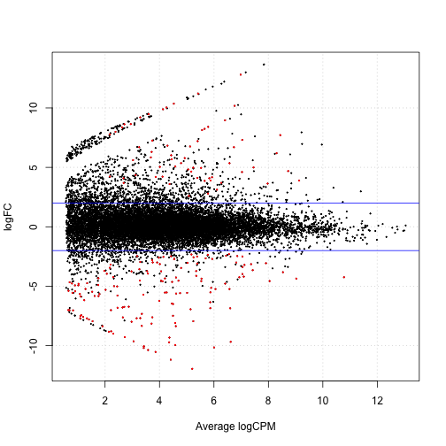

<!-- to publish run
library(slidify)
setwd("slidify_test")
publish('cage_r', 'davetang')
-->

<style>
.title-slide {
  background-color: #FFFFFF;
}
</style>

## Welcome!

> * My name is Dave; I was born in Hong Kong but raised in Papua New Guinea.
> * I'm a PhD candidate at the VU University Amsterdam.
> * I'm here to show you how to analyse CAGE data using R in Japan.

---

## I will be talking about

> * Cap Analysis Gene Expression
> * Using R and Bioconductor packages to analyse CAGE data, in particular:
> * Estimating statistical significance of feature overlaps
> * Exploratory data analysis using R
> * Data normalisation and differential expression analysis
> * Visualising high-throughput sequencing data

---

## Aims

> * I want to explain why specific commands are being used (to the best of my ability), i.e. I don't simply want to teach you a "recipe".
> * This is simply because every dataset is different and you can't follow the same recipe each time, and you can interpret your results better.

---

## Slidify

> * These slides were made using an R package called Slidify. The output shown in the slides is directly generated by R. This is to aid reproducible research.
> * These slides can be viewed and downloaded from <http://davetang.github.io/cage_r>
> * If you're interested in Slidify, have a look at <http://davetang.org/muse/2014/12/12/making-slides-using-r/> and the links within.

---

## Promoter


Source: <http://www.nature.com/scitable/topicpage/dna-transcription-426>

---

## Cap Analysis Gene Expression (CAGE)


---

## CAGE


---

## A few words on R

> * I have been using R on and off for a couple of years and it took a while to get used to.
> * Honest confession: I'm actually not very good with R (I keep a lot of documentation to make up for this).
> * You should learn it because a lot of the analysis packages for genomics data are provided via Bioconductor.

---

## Bioconductor

> * From [Wikipedia](http://en.wikipedia.org/wiki/Bioconductor): Bioconductor is a free, open source and open development software project for the analysis and comprehension of genomic data generated by wet lab experiments in molecular biology.
> * Provides state of the art software to analyse various genomic datasets.
> * Has well written guides for biologists!
> * To learn more take a look at these [courses](http://bioconductor.org/help/course-materials/), which are provided by the Bioconductor team.

---

## Some basics in R


```r
class(iris)
```

```
## [1] "data.frame"
```

```r
head(iris)
```

```
##   Sepal.Length Sepal.Width Petal.Length Petal.Width Species
## 1          5.1         3.5          1.4         0.2  setosa
## 2          4.9         3.0          1.4         0.2  setosa
## 3          4.7         3.2          1.3         0.2  setosa
## 4          4.6         3.1          1.5         0.2  setosa
## 5          5.0         3.6          1.4         0.2  setosa
## 6          5.4         3.9          1.7         0.4  setosa
```

---

## Subsetting


```r
head(subset(iris, Sepal.Width > 3.5))
```

```
##    Sepal.Length Sepal.Width Petal.Length Petal.Width Species
## 5           5.0         3.6          1.4         0.2  setosa
## 6           5.4         3.9          1.7         0.4  setosa
## 11          5.4         3.7          1.5         0.2  setosa
## 15          5.8         4.0          1.2         0.2  setosa
## 16          5.7         4.4          1.5         0.4  setosa
## 17          5.4         3.9          1.3         0.4  setosa
```

---

## Getting help in R


```r
#returns all the functions with 'table' in the name
apropos('table')
#opens the documentation for the function 'table'
?table
#read manual
browseVignettes('CAGEr')
```

---

## CAGE data on Bioconductor


```r
#download and install
source("http://bioconductor.org/biocLite.R")
biocLite("FANTOM3and4CAGE")
```


```r
#looking at come CAGE data
library(FANTOM3and4CAGE)
data(FANTOMtissueCAGEhuman)
lung_group <- FANTOMtissueCAGEhuman[["lung"]]
head(lung_group)
```

---

## CAGEr

The CAGEr package available on Bioconductor provides various methods for analysing CAGE data.


```r
source("http://bioconductor.org/biocLite.R")
biocLite("CAGEr")
```

Load the CAGEr package:


```r
library(CAGEr)
```

---

## A SAM/BAM file

---

## The need for normalisation


```r
control_1 <- rep(10, 50)
control_2 <- rep(10, 50)
patient_1 <- c(rep(20, 25),rep(0,25))
patient_2 <- c(rep(20, 25),rep(0,25))
df <- data.frame(c1=control_1, c2=control_2, p1=patient_1, p2=patient_2)
head(df, 2)
```

```
##   c1 c2 p1 p2
## 1 10 10 20 20
## 2 10 10 20 20
```

```r
tail(df, 2)
```

```
##    c1 c2 p1 p2
## 49 10 10  0  0
## 50 10 10  0  0
```

---

## The need for normalisation

 

---

## Differential expression without normalisation


```r
library(edgeR)
group <- c('control','control','patient','patient')
d <- DGEList(counts=df, group=group)
d <- estimateCommonDisp(d)
de <- exactTest(d)
table(p.adjust(de$table$PValue, method="BH")<0.05)
```

```
## 
## TRUE 
##   50
```

---

## Differential expression with normalisation


```r
TMM <- calcNormFactors(d, method="TMM")
TMM$samples
```

```
##      group lib.size norm.factors
## c1 control      500    0.7071068
## c2 control      500    0.7071068
## p1 patient      500    1.4142136
## p2 patient      500    1.4142136
```

```r
TMM <- estimateCommonDisp(TMM)
TMM <- exactTest(TMM)
table(p.adjust(TMM$table$PValue, method="BH")<0.05)
```

```
## 
## FALSE  TRUE 
##    25    25
```

---

## Genomic ranges


```r
library(IRanges)
ir <- IRanges(5,10)
ir
```

```
## IRanges of length 1
##     start end width
## [1]     5  10     6
```

```r
start(ir)
```

```
## [1] 5
```

```r
end(ir)
```

```
## [1] 10
```

```r
width(ir)
```

```
## [1] 6
```

---

## Statistical significance of feature overlaps

Check out my blog post <http://davetang.org/muse/2014/11/07/using-genometricorr-package/>


```r
install.packages('GenometriCorr',
                 repos='http://genometricorr.sourceforge.net/R/',
                 type='source')

cpg <- read.table(url("http://quinlanlab.cs.virginia.edu/cshl2013/cpg.bed"),
                  header=F,
                  sep="\t",
                  stringsAsFactors = F)

chr <- read.table(url("http://quinlanlab.cs.virginia.edu/cshl2013/hesc.chromHmm.bed"),
                  header=F,
                  sep="\t",
                  stringsAsFactors = F)
```

---

## Clustering


---

## Formula

$$ a^2 + b^2 = c^2 $$

---

## To be continued

